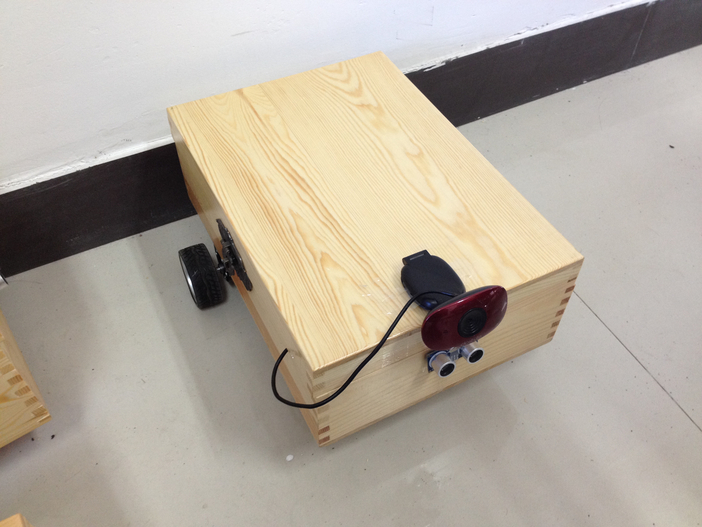
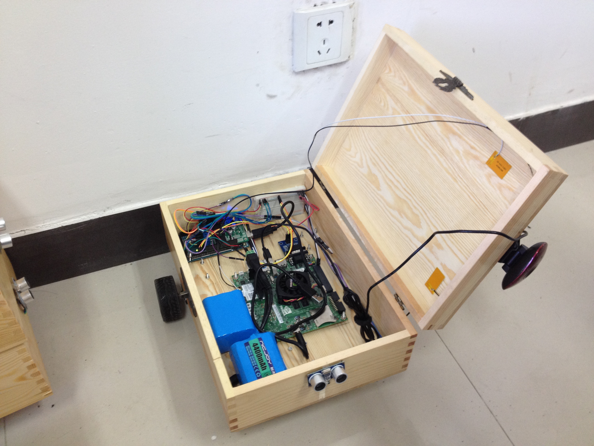

# woodbox-mobile-car





## Description
The codes of embedded system for robotics experiment in summer school. It can implement the functions are: simple serial control, simple ultrasonic obstacle avoidance and following based on face recognition.

### Arduino
1、**woodbox_mobile_car_serial_control:**<br>
Control the car move by using serial port.

2、**woodbox_mobile_car_obstacle_avoidance:**<br>
Make the car avoid obstacles by using ultrasonic sensor.

3、**woodbox_mobile_car_follow_people:**<br>
Make the car follow people by using face recognition from jetson tk1.

### Jetson TK1
1、**face_capture:**<br>
Capture some face's pictures from camera, convert them to gray images and resize them to default size.

2、**face_detection:**<br>
Detect faces by using opencv haar cascade classifier.

3、**face_train:**<br>
Before starting to recognize face, use some face's pictures to train for generating face's model file.

4、**face_recognition:**<br>
Load face's model file and receive specific faces to start face recognition.

## Configure
Use following command to get woodbox-mobile-car sources:

```bash
$> cd ~/Desktop
$> git clone https://www.github.com/myyerrol/woodbox-mobile-car.git
```

### Arduino
1、Move the **arduino/WoodboxMobileCar** floder to your **Arduino/libraries**. In linux, the default location of arduino libraries is **~/Arduino/libraries**, if you change it, please use new path to replace under!

```bash
$> cp -r woodbox-mobile-car/arduino/WoodboxMobileCar ~/Arduino/libraries
```

2、Open the arduino software, and you can find three demo files in the **File/Examples/WoodMobileCar** option. You can load any of these to test their function.

### Jeston TK1
1、**face_capture:**<br>
This part of codes use cmake build system. If you want to use IDE to edit or improve these codes, you can start qtcreator and open **CMakeLists.txt** file to load this project. Of course, you also can build them in the terminal directly by using following command.
```bash
$> cd woodbox-mobile-car/jetson_tk1/face_capture
$> mkdir build
$> cd build
$> cmake ..
$> make
$> ./face_capture
```
2、**face_detection:**<br>
This part of codes use cmake build system. If you want to use IDE to edit or improve these codes, you can start qtcreator and open **CMakeLists.txt** file to load this project. Of course, you also can build them in the terminal directly by using following command.
```bash
$> cd woodbox-mobile-car/jetson_tk1/face_detection
$> mkdir build
$> cd build
$> cmake ..
$> make
$> ./face_detection
```

3、**face_recognition:**<br>
Before building, please replace the paths of **face_train.txt** to yours!
```bash
$> cd woodbox-mobile-car/jetson_tk1/face_recognition
$> make all
$> ./face_train face_train.txt
$> ./face_recognition
```

## Summary
Though the time is limited, I still have learned some knowledges about how to use opencv to implement simple face detection and recognition in nvidia jetson tk1. I believe I can do better in the future!
